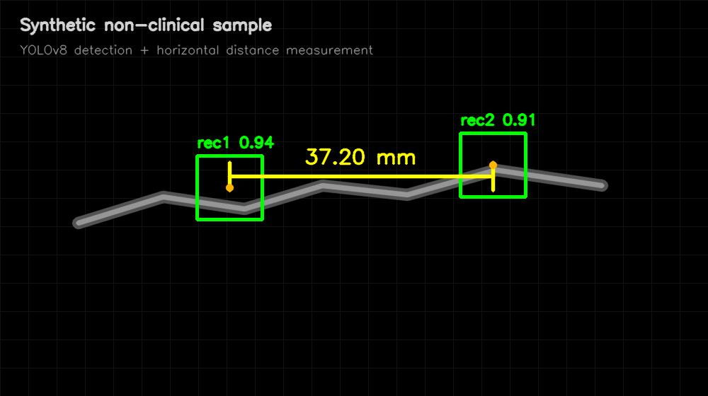

# Medical Imaging: YOLO-based Measurement and DICOM Analytics

This project is a professional computer vision pipeline designed to automate object detection and physical distance measurements directly from raw medical imaging data.

Instead of relying on manual endpoint marking, this system processes raw DICOM files, extracts frames, and uses a custom-trained YOLOv8 model to identify specific anatomical or device endpoints, such as coronary angiography measurement points. It calculates real-world horizontal distances between detected points and automatically generates comprehensive PDF reports for clinical or analytical review.

**Key Features:**

- **End-to-End Pipeline:** From raw `.dcm` files to annotated PDF reports.
- **CLI Architecture:** Fully orchestrated through a modular command-line interface (`main.py`).
- **Dynamic Physical Calibration:** Automatically extracts `PixelSpacing` metadata directly from DICOM headers to calculate precise, real-world measurements in millimeters regardless of image resolution.
- **HPC Ready:** Configured for remote training on high-performance computing clusters, including the Kronosz server.
- **Data Privacy Compliant:** All datasets, DICOM files, and model weights are strictly git-ignored to protect sensitive medical data.

## Tech Stack

Python 3.x, Ultralytics YOLOv8, OpenCV, pydicom for DICOM parsing, PyTorch with CUDA-enabled training, pandas, and fpdf2.

## Example Output

The image below is a fully synthetic, non-clinical example created only to demonstrate the expected visual output format. Real DICOM data and trained model weights are intentionally excluded from the repository.



## Project Structure

```text
aorta_student/
|-- main.py                         # CLI entry point for extract, convert, train, and predict workflows
|-- requirements.txt                # Python dependencies
|-- data/
|   |-- data.yaml                   # YOLO dataset configuration
|   |-- prediction/
|   |   `-- model_predictor.py      # Inference, DICOM calibration, measurement, and PDF export
|   `-- train/
|       `-- model_training.py       # YOLOv8 training configuration
|-- data_prep_scripts/
|   |-- extracted_frames.py         # DICOM-to-frame extraction
|   `-- json_to_txt.py              # VoTT JSON to YOLO TXT conversion
|-- docs/
|   `-- example_output.png          # Synthetic non-clinical visual example
|-- utils/
|   `-- logger_setup.py             # Shared logging setup
|-- config/
|-- docker/
|-- inference/
|-- logs/                           # Runtime logs are ignored except .gitkeep
|-- reports/                        # Generated reports are ignored except .gitkeep
`-- tests/
```

Model weights such as `best.pt`, raw DICOM files, datasets, generated reports, and training outputs are intentionally excluded from version control.

## Installation

```bash
pip install -r requirements.txt
```

## Usage Instructions

### 1. Extract Frames from DICOM

Converts all DICOM files in a source directory into a flat collection of JPG images.

```bash
python main.py extract --input "data/dataset/raw_dicom" --output "data/dataset/all_frames"
```

### 2. Convert Annotations

Converts VoTT JSON exports to YOLO TXT format.

```bash
python main.py convert --input "path/to/json/folder" --output "data/dataset/labels"
```

### 3. Train the Model

Trains a YOLO model using the prepared dataset. Results are saved in the `runs/` directory.

```bash
python main.py train --model yolov8n.pt --input "data/data.yaml"
```

### 4. Run Prediction

Performs detection, extracts DICOM calibration metadata when available, measures horizontal distances in millimeters, and generates annotated images plus a PDF report.

**Single Image:**

```bash
python main.py predict --mode single --input "data/dataset/test/images/frame_0010.jpg" --model best.pt --dicom "data/dataset/raw_dicom/sample_reference.dcm"
```

**Batch Directory:**

```bash
python main.py predict --mode batch --input "data/dataset/test/images" --model best.pt --dicom "data/dataset/raw_dicom/sample_reference.dcm"
```

**Video:**

```bash
python main.py predict --mode video --input "data/dataset/test/videos/sample.mp4" --model best.pt
```

## Kronosz HPC Setup

To run the training on the Kronosz server, ensure all dependencies are installed and use the `train` command. The results will be stored in the `runs/detect/train/` folder.

## Git Ignore

The following artifacts are excluded from version control:

- datasets and DICOM files
- trained model weights
- runtime logs, reports, predictions, and training runs
